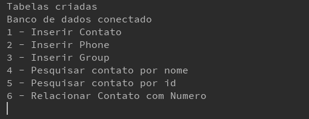
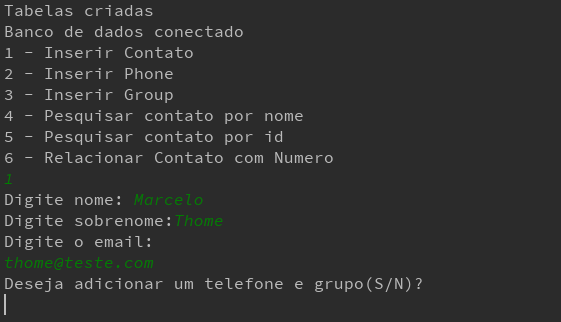
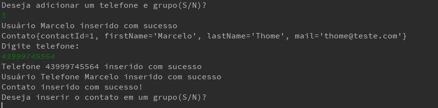

# Lista Telefônica MVC


## Introdução

É uma lista telefônica para adicionar contatos, número e criar grupos, onde um grupo pode ter N contatos.

## Tecnologias

Linguagem: Java 8
Banco: SQLite


## Start Project🏃‍

Ao iniciar o projeto, será listado um menu com 4 opções:

| |COMANDOS|
|---|---|
Inserir Contato|Essa função é para adicionar um novo contato, podendo ter a opção de já adiciona-lo em um grupo . | |
Inserir Phone | Inserir um número de telefone novo.||
Inserir Group | Inserir um novo grupo  | |
Pesquisar contato por nome ou Id| Função para pesquisar um contato pelo nome ou pelo id  ||
Relacionar Contato com Numero| Função para relacionar um telefone a um contato existente  ||
Relacionar Contato com Grupo| Função para inserir um contato em um grupo  ||
Deletar contato | Deletar um contato pelo email dele ||
Listar contatos do grupo  | Listar todos os contatos de um grupo ||
Listar contatos  | Listar todos os contatos existentes||

Colaborar para a atividade:

```bash
git https://github.com/MarLubanco/conexao-jdbc-faculdade.git
cd conexao-jdbc-faculdade

```

## Especificação de Caso de Uso 

### Fluxo Básico de Eventos

O usuário do sistema poderá ter vários comandos para utilizar, todas as opções são relacionadas ao contato, podendo ser adicionar contato, excluir contato, listar todos os contatos cadastrados, pesquisar contato por id ou por nome e adiciona-lo a um grupo e adicionar um telefone para o mesmo.

####  Fluxo Básico - Cadastrar Contato
Através do comando "1" é possível adicionar um novo contato, onde irá aparecer um formulário para o usuário preencher
2. Preencher o nome, sobrenome e email
3. Clicar em "ENTER"

#### Fluxo Básico - Listar Contatos
Através do comando "10" o sistema irá listar todos os contatos cadastrados

#### Fluxo Básico - Pesquisar Contato
Através do comando "4" ou "5" é possível pesquisar por nome ou id o contato.


#### Fluxo Básico - Editar uma Venda
Através do comando "7" é possível adicionar um contato a um grupo existente.
1. Especificar o nome do contato e qual grupo ele irá entrar.

#### Fluxos Alternativos
Ao cadastrar um contato, o usuário pode querer adicionar o contato diretamente a um grupo e a um número, ao invés de adiciona-lo mais tarde.

## 6. Condições Prévias
1. Para adicionar um contato a um grupo posteriormente a adicionar o contato, o grupo já deve existir.
2. Para adicionar um contato a um número posteriormente a adicionar o contato, o número já deve existir.

## Documentação
- **Caso de Uso —**


## Imagens do projeto

<div align="center">
      
</div>

<div align="center">
  <strong>Listagem dos contatos</strong>
</div>
<br>
<hr>

<div align="center">
      
</div>

<div align="center">
  <strong>Listagem dos contatos</strong>
</div>
<br>
<hr>

<div align="center">
      
</div>

<div align="center">
  <strong>Pesquisa por nome</strong>
</div>